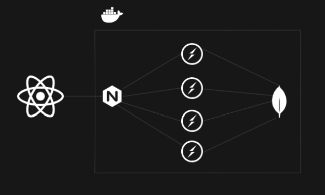

# 📡 Real-Time Chat Application
A scalable real-time chat application built with Node.js, TypeScript, Redis, MongoDB, Socket.IO, and React, containerized with Docker and load-balanced using NGINX.

# 📽️ Overview
This project demonstrates a scalable real-time chat system where:

Participants can join chat rooms and chat in real time.

<!-- Admins can create and manage quiz sessions. -->

<!-- Spectators can observe quiz sessions. -->

It supports high concurrency via multiple Node.js processes, Redis Pub/Sub for real-time sync, and NGINX for load balancing.

# 🧱 Architecture
High-Level Architecture
pgsql
Copy
Edit
```code
Client (React + Redux + Socket.IO)
      |
      v
+-----------------------------+
|       NGINX Load Balancer  |
+-----------------------------+
      |       |       |      \
   [ws1]   [ws2]   [ws3]   [ws4]  <-- Node.js WebSocket(socket.io) servers
      |       |       |       |
      ------------ Redis Pub/Sub <----> Real-time sync
                 |
              MongoDB
```
# ⚙️ Technologies Used
## 💻 Frontend
React + TypeScript

Redux Toolkit + RTK Query

Socket.IO Client

TailwindCSS

## 🖥️ Backend
Node.js + TypeScript

Express.js

Socket.IO Server

MongoDB (via Mongoose)

Redis (Pub/Sub for message syncing)

Docker & Docker Compose

NGINX (load balancing)

<!-- 📦 Project Structure
css
Copy
Edit
.
├── frontend/
│   ├── src/
│   └── Dockerfile
├── backend/
│   ├── src/
│   │   ├── lib/
│   │   │   ├── redisManager.ts
│   │   │   ├── socket.ts
│   │   └── index.ts
│   ├── Dockerfile
│   └── .env
├── nginx.conf
├── docker-compose.yml
└── README.md -->
# 🚀 Features
Real-time communication via Socket.IO

Horizontal scalability with Redis Pub/Sub

Clean modular code using TypeScript

round robbin connection distribution via NGINX

<!-- Admin panel for managing quiz sessions -->

<!-- Multiple user roles: Admin, Participant, Spectator -->

Fully containerized with Docker

## Architecture




# 🐳 Dockerized Deployment
1. Clone the repo
```bash
git clone https://github.com/yourusername/chat-app.git

`inject .env`
cd chat-app/server
pnpm i
docker build -f Dockerfile -t chat_server:latest .
docker-compose up --build
```
> This will spin up:

4 WebSocket servers (ws1 to ws4)

A Redis server

A MongoDB database

An NGINX reverse proxy (port 8080)

Frontend server (optional, based on setup)

Access the REST ENPOINTS at http://localhost:8080/api/v1/  
and websocket connection at http://localhost:8080

# 📡 WebSocket Scaling
Each Node.js server is a separate container and connects to Redis for message broadcasting.

Redis Pub/Sub ensures:

Messages sent to one container are propagated to all others.

Real-time consistency across the cluster.


> FUTURE SCOPE NGINX with Sticky Sessions:  
> Routes users consistently to the same backend server (important for WebSocket state).  
> Configured using ip_hash in nginx.conf.  

# 🧪 Testing the App
Open multiple browser tabs or devices.

Connect as different users.

Observe real-time updates and chat flow across tabs.

Monitor docker-compose logs -f to trace server activity.

# 🛠️ Development Setup
Prerequisites
Node.js v20+

Docker & Docker Compose

pnpm or npm

Local Dev (Optional without Docker)
```bash
cd backend
pnpm i
pnpm run dev

cd frontend
pnpm i
pnpm run dev
Ensure local MongoDB and Redis are running or update .env to connect to Docker containers.
```
# ✍️ Author
Ayush Kumar — Engineer, Builder, Learner
🔗 GitHub: @ayushk101
📬 Email: socialacc211@gmail.com

## 🏁 Future Improvements

Rate Limiting and Throttling

User Presence Detection

Horizontal Scaling with Kubernetes

HA Redis Setup (Redis Sentinel or Cluster)

Sticky Session using IP hash or cookie


<!-- 
### NOTE
- if running standalone server docker image, inject .env through
```bash
docker run --env-file .env -p 8080:8080 <your-image-name>
``` -->