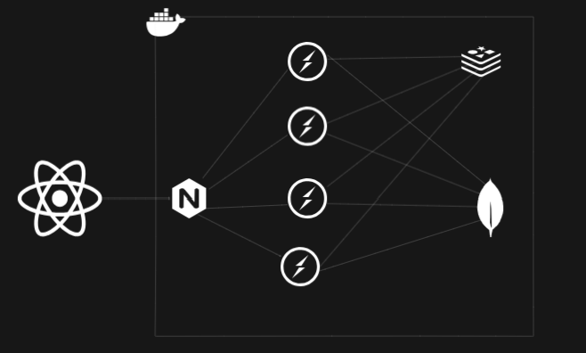

# 📡 Real-Time Chat Application
A scalable real-time chat application built with Node.js, TypeScript, Redis, MongoDB, Socket.IO, and React, containerized with Docker and load-balanced using NGINX.

# 📽️ Overview
This project demonstrates a scalable real-time chat system where:

Participants can join chat rooms and chat in real time.

<!-- Admins can create and manage quiz sessions. -->

<!-- Spectators can observe quiz sessions. -->

It supports high concurrency via multiple Node.js processes, Redis Pub/Sub for real-time sync, and NGINX for load balancing.

# 🧱 Architecture
High-Level Architecture

```code
Client (React + Redux + Socket.IO)
      |
      v
+-----------------------------+
|       NGINX Load Balancer  |
+-----------------------------+
      |       |       |      \
   [ws1]   [ws2]   [ws3]   [ws4]  <-- Node.js WebSocket(socket.io) servers
      |       |       |       |
      ------------ Redis Pub/Sub <----> Real-time sync
                 |
              MongoDB
```

# Capacity & Performance Estimation
🧪 These numbers are approximations based on typical hardware and default configurations. Actual results may vary depending on optimization, deployment platform, and network conditions.

## ⚙️ System Overview

| Component       | Technology             | Notes                                           |
|----------------|------------------------|-------------------------------------------------|
| WebSocket App  | Node.js + Socket.IO    | Real-time bidirectional communication           |
| Broker         | Redis (Pub/Sub)        | Message sync across processes                  |
| Load Balancer  | NGINX (Sticky Sessions)| Ensures clients stick to the same server        |
| DB             | MongoDB                | For persistent user/session/quiz data           |

> NOTE sticky session is future scope here.

## 🧮 1. WebSocket Server Capacity (Node.js + Socket.IO)
Capacity depends on:

- CPU and event loop latency (WebSocket is async but CPU-bound logic can block)

- RAM per connection (metadata, buffer, and ping-pong interval)

- Network I/O

#### 🔢 Rough Estimation
| Metric	| Value| 
|---------|-------|
| Average memory per client	| ~40KB
| Messages/sec/client	| 1–10
| Max connections/server | 	~10,000–30,000*
| Max emit latency |	~5–20ms under low load
| Number of CPU cores	1 |  (single Node process)

```md
-💡 With 1 vCPU and 1GB RAM, a single Node.js WebSocket server using Socket.IO can reliably support ~10,000 concurrent connections, assuming:  
- Keep-alive (heartbeat) every 25s  
- Minimal per-client state  
- Redis Pub/Sub handles cross-process broadcasts  
## If you launch 4 replicas, that's ~40,000 concurrent users under average load.
```

## 🔄 2. Redis Pub/Sub Capacity
| Metric	| Value | 
|--------|---------
| Max messages/sec	| 500,000+ (on a single Redis instance)
| Typical latency |	~1ms
| Max subscribers/topic	| 10,000+
| Memory per channel	| negligible
-----------------------------

```md
> NOTE 
⚠️ Redis Pub/Sub does not persist messages. If your system goes down or a client disconnects, those messages are lost.

Redis can easily handle broadcasting between dozens of WebSocket servers for chat applications.
```

## 🧊 3. NGINX Load Balancer
| Metric	| Value | 
|---------|-------|
| Max concurrent connections| 	512–65,000 (tuned via worker_rlimit_nofile)
| Max throughput | 	10k–50k requests/sec (depends on CPU)
-------------------


## 🧮 4. MongoDB Capacity
MongoDB is not on the critical path for real-time messages (handled by Redis + Socket.IO), but it handles:

- User logins
- Chat history 
- Session management

| Metric	| Value |
|---------|--------|
| Write capacity (default) |	5,000+ ops/sec
| Read capacity (default)	| 10,000+ ops/sec
| Latency (read/write)	| ~1–10ms
---------------

### Can be Scaled with: 

- Replica Sets for high availability
- Sharding for horizontal scaling
- Indexing to reduce query latency

# 🧠 5. Total System Estimation
Assume 1 vCPU, 1GB RAM per Node.js server/process/container.

| Component	Est. | Capacity
|----------------|----------
| WS server (1 replica) |	~10,000 concurrent clients
| WS server (4 replicas) |	~40,000 concurrent clients
| Redis broker	| ~500,000+ messages/sec
| MongoDB (single) | 	~10,000 ops/sec (reads/writes)
| NGINX	| ~10k–50k connections/sec (tunable)
-----------
<!-- 
# 📌 Benchmarks Tools to Test
- `autocannon` – HTTP/WebSocket load testing

- `socket.io-benchmarking`
- 
- `wrk` – HTTP benchmarking
- 
- `redis-benchmark`
- 
- [`mongostat`, `mongotop`] – MongoDB monitoring -->


# ⚙️ Technologies Used
## 💻 Frontend
- React + TypeScript

- Redux Toolkit + RTK Query
 
- Socket.IO Client
 
- TailwindCSS
 
## 🖥️ Backend
- Node.js + TypeScript
 
- Express.js
 
- Socket.IO Server
 
- MongoDB (via Mongoose)
 
- Redis (Pub/Sub for message syncing)
 
- Docker & Docker Compose

- NGINX (load balancing)

<!-- 📦 Project Structure
css
Copy
Edit
.
├── frontend/
│   ├── src/
│   └── Dockerfile
├── backend/
│   ├── src/
│   │   ├── lib/
│   │   │   ├── redisManager.ts
│   │   │   ├── socket.ts
│   │   └── index.ts
│   ├── Dockerfile
│   └── .env
├── nginx.conf
├── docker-compose.yml
└── README.md -->
# 🚀 Features
- Real-time communication via Socket.IO

- Horizontal scalability with Redis Pub/Sub

- Clean modular code using TypeScript

- round robbin connection distribution via NGINX

- Fully containerized with Docker ( frontend optional )

## 📸 Architecture




# 🐳 Dockerized Deployment
1. Clone the repo
```bash
git clone https://github.com/yourusername/chat-app.git

`inject .env`
cd chat-app/server
pnpm i
docker build -f Dockerfile -t chat_server:latest .
docker-compose up --build
```

> This will spin up:
```md
- 4 WebSocket servers (ws1 to ws4)

- A Redis server
 
- A MongoDB database
 
- An NGINX reverse proxy (port 8080)
 
- Frontend server (optional, based on setup)
```

> Access the REST ENPOINTS at http://localhost:8080/api/v1/  
> and websocket connection at http://localhost:8080

# 📡 WebSocket Scaling
Each Node.js server is a separate container and connects to Redis for message broadcasting.

Redis Pub/Sub ensures:

- Messages sent to one container are propagated to all others.

- Real-time consistency across the cluster.
 

# 🧪 Testing the App
Open multiple browser tabs or devices.

Connect as different users.

Observe real-time updates and chat flow across tabs.

Monitor docker-compose logs -f to trace server activity.

# 🛠️ Development Setup
## Prerequisites
```
Node.js v20+

Docker & Docker Compose

pnpm or npm
```
## Local Dev (Optional without Docker)
```bash
cd backend
pnpm i
pnpm run dev

cd frontend
pnpm i
pnpm run dev
Ensure local MongoDB and Redis are running or update .env to connect to Docker containers.
```

# ✍️ Author
Ayush Kumar — Engineer, Builder, Learner
🔗 GitHub: @ayushk101
📬 Email: socialacc211@gmail.com

## 🏁 Future Improvements

- Rate Limiting and Throttling
- 
- User Presence Detection
- 
- Horizontal Scaling with Kubernetes
- 
- HA Redis Setup (Redis Sentinel or Cluster)

- FUTURE SCOPE NGINX with Sticky Sessions:  
  - Routes users consistently to the same backend server (important for WebSocket state).  
  - Configured using ip_hash in nginx.conf. 


<!-- 
### NOTE
- if running standalone server docker image, inject .env through
```bash
docker run --env-file .env -p 8080:8080 <your-image-name>
``` -->